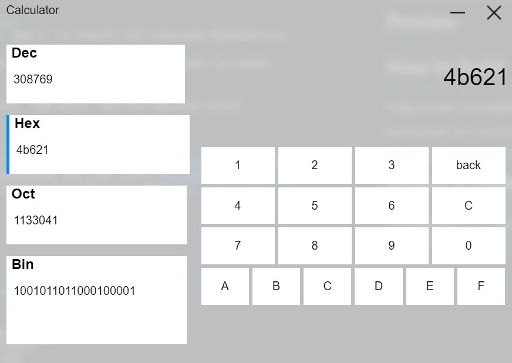

# number-system-calculator
Minimal ui for calculation from number system to another.

# Preview 

# How to build
Firstly run `npm i` to install all required dependencies.

now run `npm run build` to convert es6 codes to common js codes.

after that run `npm start` and the app will start working!

# Download
Download the installer from [here](https://github.com/tusharb05/number-system-converter/raw/main/windows/downloads/number-system-converter%20Setup%201.0.0.exe) (Fully open source and safe)

# How is it made?
It is built using [electron](https://electronjs.org) and obviously javascript and used [Babel](https://babeljs.io/) for compiling of es6 codes to common js.

Made by [abh80](https://github.com/abh80) with ❤️